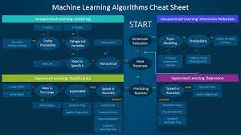

# 인공지능창의설계

## 인공지능의 이해

### 인공지능의 개념
 - 인공지능
   - 1950년대에 등장한 개념으로 인공적으로 만들어진 지능을 의미
 - 머신러닝
   - 데이터
 - 딥러닝

### 인공지능의 역사  
 - 초기 인공지능
   - 심볼릭 AI
   - 전문가 시스템
     - 1980년대에 등장한 새로운 체계
     - 인간의 지식을 컴퓨터가 사용하기 좋은 형태로 만들어서 널리 활용하려는 의도를 갖고 탄생
     - 방대한 규칙을 사람이 일일이 만들기도 어렵고 새로운 정보를 추가하기도 힘들어 인공지능에 대한 회의감으로 이어짐
   - 머신러닝
 
  

 - 인공신경망
   - 시카고 대학교 신경정신과의 워렌 맥컬록과 논리학자 월터 피츠가 1943년에 발표한 연구에서 시작
   - 인공 신경을 그물망 형태로 연결하면 뇌의 간단한 동작을 흉내 낼 수 있다는 것을 이론적으로 증명
   - 1957년 코넬 항공연구소의 프랑크 로젠블라트는 인간의 뇌가 신호를 전달하는 체계를 모방한 퍼셉트론 인공신경망 공개

 

## 머신러닝의 유형 
### 지도 학습
- 주어진 데이터에 정답이 존재하는 경우 미지의 데이터에 대한 정답을 예측하는 학습 방법
- 대표적인 예로는 분류와 회귀가 있음
- 분류와 회귀를 구분하는 가장 간단한 방법은 데이터의 성질을 보고 판단하는 것
- 분류
  - 
- 회귀
  - 

 

### 비지도 학습
- 정답(레이블)이 없는 데이터를 보고 유용한 패턴을 추출
- 지도학습의 가장 큰 차이는 학습 과정에서 데이터의 정답이 주어지는지 여부
- 대표적인 예로 군집화와 차원 축소가 있음

- 군집화
  - 정답이 주어지지 않은 상태에서 데이터를 분류하는 방법으로, 데이터 분포를 보고 특성이 비슷한 것을 군집으로 묶음

- 차원축소
  - 분석하기 어려운 고차원 데이터의 특성 수를 줄이면서 중요한 특성을 포함하는 저차원 데이터로 표현하는 방법
  - 고차원 데이터를 2차원 평면에 표현하는 데이터 시각화와 이미지 압축 등

 

### 강화학습
- 기계(에이전트)와 환경 사이의 상호 작용을 통해 학습하는 방법
- 에이전트가 환경으로부터 보상을 최대화하는 방향으로 학습을 진행
- 문제에 대한 접근 방식 차이로 구분

 

 

## 앙상블(Ensemble) 기법

### Bagging (Bootstrap Aggregation)
- Bagging은 약분류기르르 같은 알고리즘 사용
- 대표적으로 RandomForest

 
